# EFullPay Point of Sale (POS) System Documentation

## Overview

EFullPay adalah sebuah perangkat lunak yang dibuat untuk membantu pemilik toko retail dalam hal pengaturan stok dan pencatatan transaksi. User akan dimudahkan dalam proses pengaturan barang dan stok barang di gudang. User juga akan dimudahkan dalam melakukan proses transaksi barang dan mengecek stok barang yang tersisa. Di akhir proses transaksi, user dapat melihat kembali barang-barang yang dibeli oleh konsumen dan total tagihan yang kemudian akan dicatat oleh sistem untuk dilaporkan dalam format rekapitulasi transaksi.

## Cara Menjalankan Aplikasi

1. **Clone repository:**

    ```bash
    git clone https://gitlab.informatika.org/k2_g2/efullpay.git
    ```

2. **Navigasi ke direktori project:**

    ```bash
    cd efullpay
    ```

3. **Install dependencies:**

    ```bash
    npm install
    ```
    Untuk semua modul dependency pada `package.json`.

4. **Jalankan aplikasi:**

    ```bash
    npm start
    ```

   Server bisa diakses pada `http://localhost:8080` secara default.

## Autentikasi User

**Admin**
```
username : user1
password : password1
```
**Hak :** 
- Mengatur akun karyawan
- Mengatur stok dan detail barang
- Menambahkan transaksi
- Akses pada rekapitulasi transaksi

**Karyawan Gudang**
```
username : user2
password : password2
```

**Hak :** 
- Mengatur stok dan detail barang

**Kasir**
```
username : user3
password : password3
```

**Hak :** 
- Melihat informasi barang
- Menambahkan transaksi

## Daftar Use Case Yang Diimplementasikan

### Use Case 1 : Login

**Nama** : Muhammad Farrel
**NIM** : 10023225

**Capture Screen** :

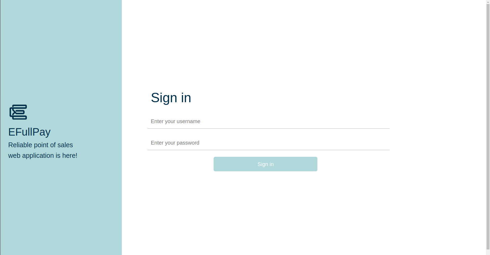

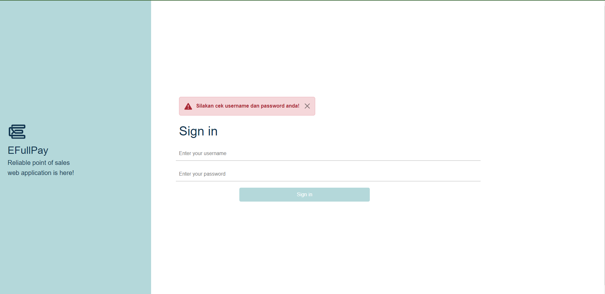

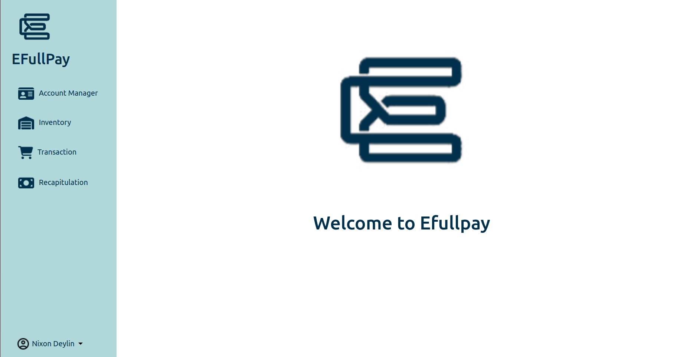

### Use Case 2 : CRUD Akun

**Nama** : Damian Marvel
**NIM** : 18221164

**Capture Screen** :

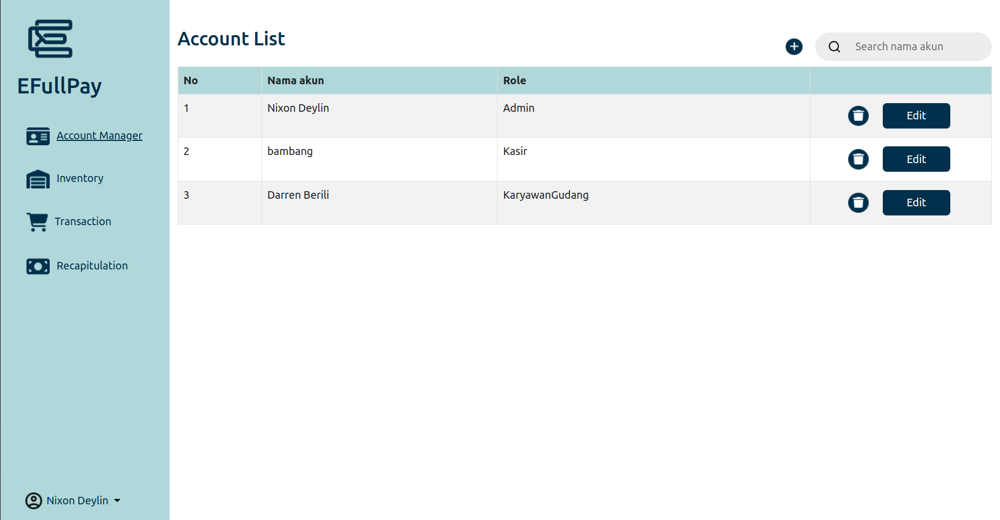

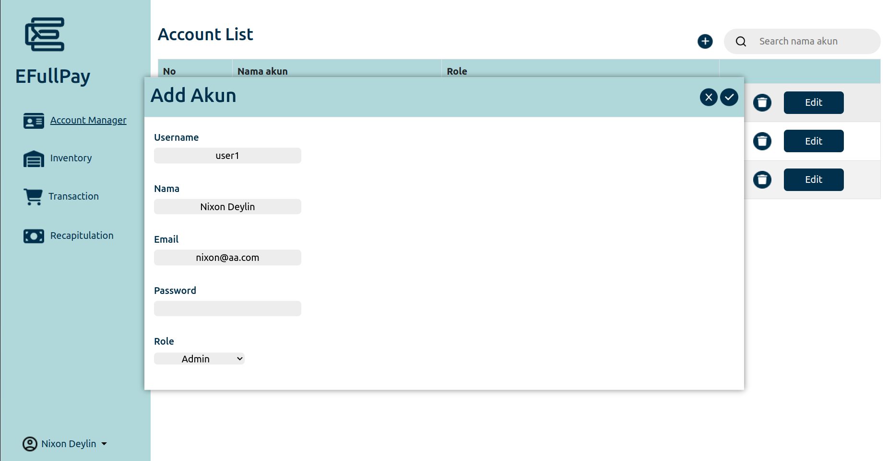

### Use Case 3 : CRUD Barang

**Nama** : Damian Marvel,Nixon Deflin Kurniawan
**NIM** : 18221164,18221150

**Capture Screen** :

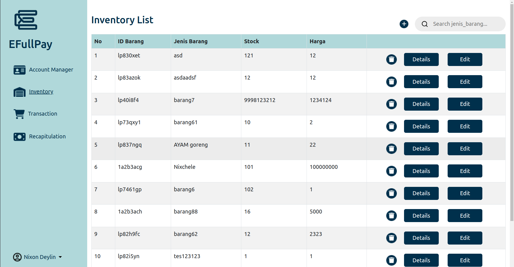

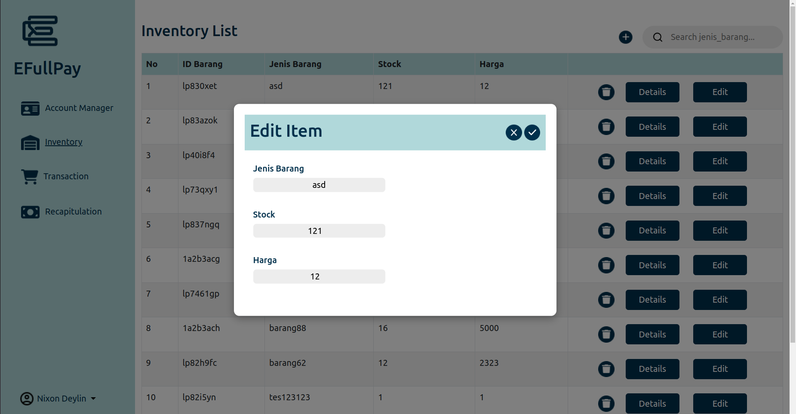


### Use Case 4 : CRUD Shopping Cart

**Nama** : Rei Arriel Clyfton
**NIM** : 18221084

**Capture Screen** :

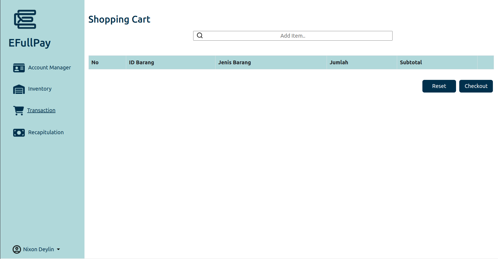


### Use Case 5 : Search

**Nama** : Nixon Deflin Kurniawan
**NIM** : 18221150

**Capture Screen** :

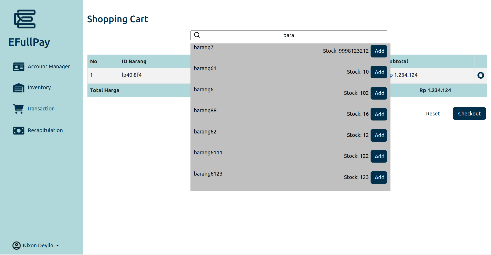

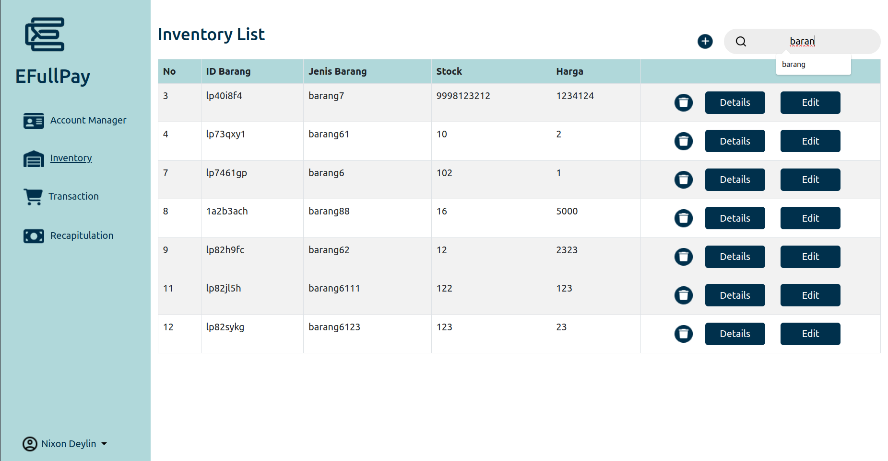

### Use Case 6 : Detail Barang

**Nama** : Darren
**NIM** : 18221050

**Capture Screen** :

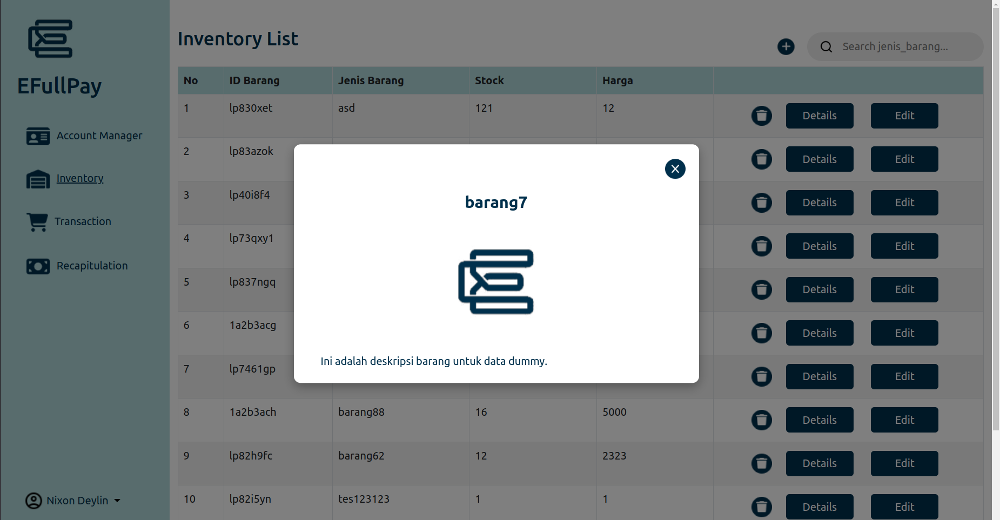

### Use Case 7 : Transaksi

**Nama** : Rei Arriel Clyfton
**NIM** : 18221084

**Capture Screen** :

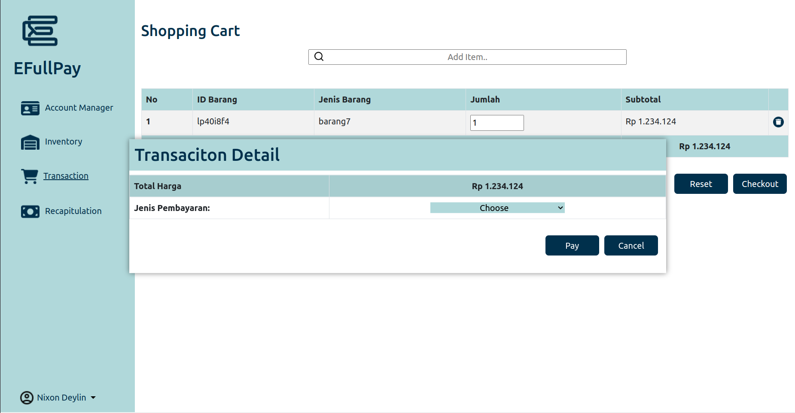

### Use Case 8 : Recapitulation

**Nama** : Darren
**NIM** : 18221050

**Capture Screen** :

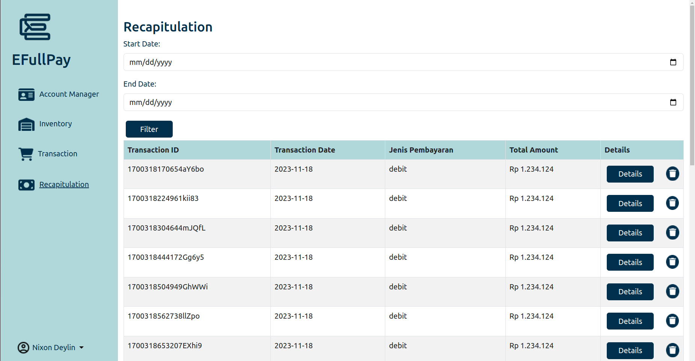

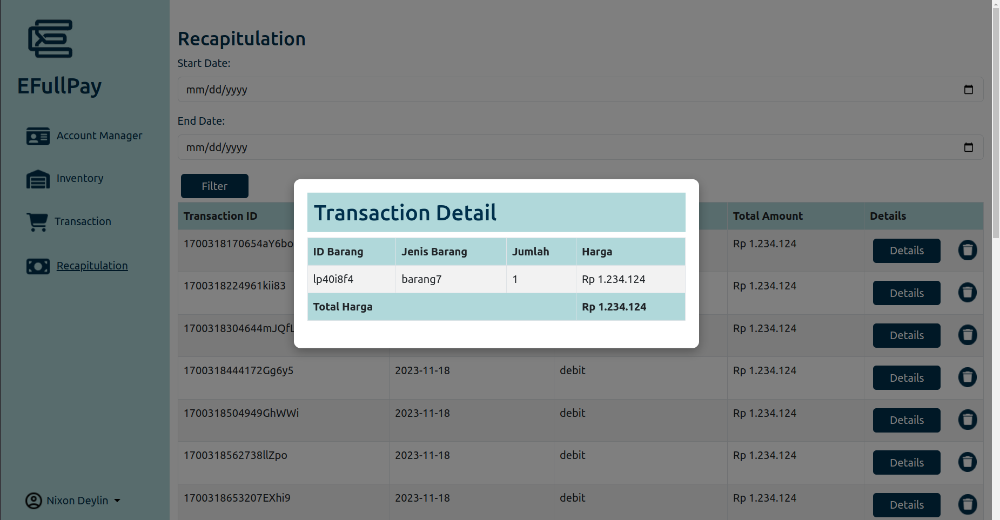


## Skema Database

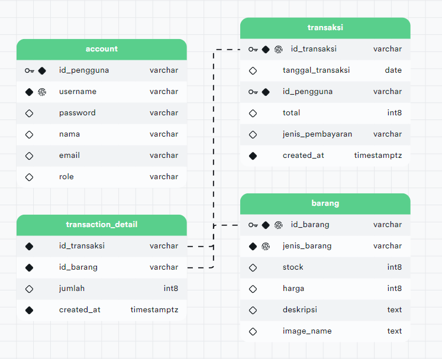
